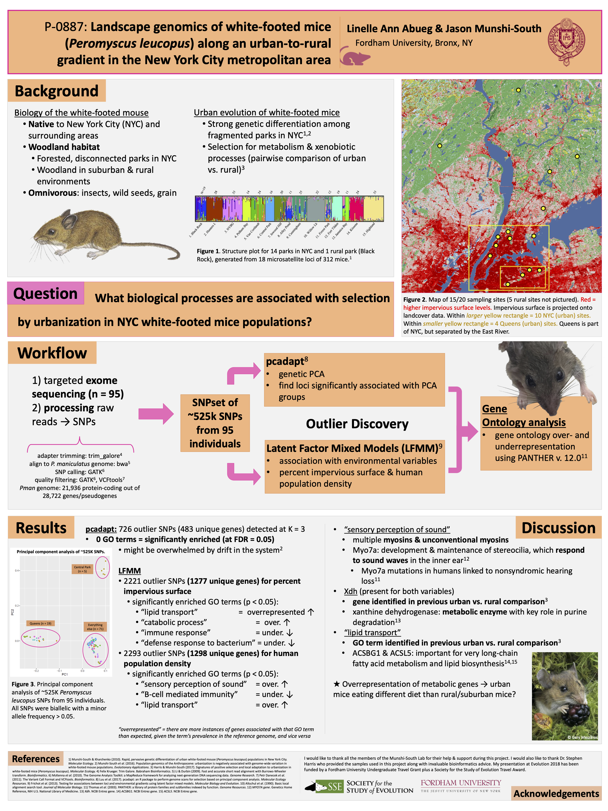

<h1> Landscape genomics of white-footed mice (<i>Peromyscus leucopus</i>) along an urban-to-rural gradient in the New York City metropolitan area</h1>

<h3> Linelle Ann Abueg & Jason Munshi-South </h3>

<h4>:round_pushpin: Evolution (Montpellier, France - August 2018) </h4>

Please click through for higher resolution.

