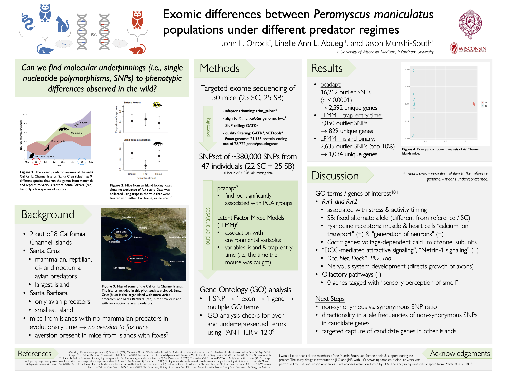

# Exomic differences between *Peromyscus maniculatus* populations under different predator regimes

### John L. Orrock, **Linelle Ann L. Abueg**, and Jason Munshi-South 

#### :round_pushpin: Ecological Methods Course (Louis Calder Center, NY - December 2018) 

Please click through for higher resolution.

