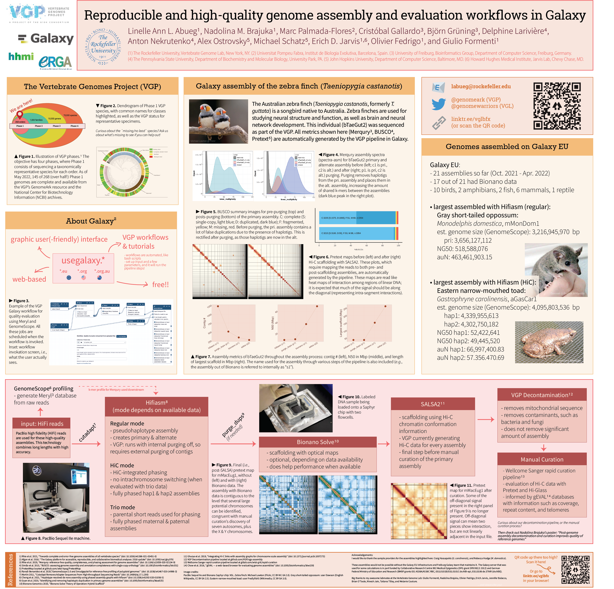

# Reproducible and high-quality genome assembly and evaluation workflows in Galaxy

### **Linelle Ann L. Abueg**, Nadolina M. Brajuka, Marc Palmada-Flores, Cristóbal Gallardo, Björn Grüning, Delphine Larivière, Anton Nekrutenko, Alex Ostrovsky, Michael Schatz, Erich D. Jarvis, Olivier Fedrigo, and Giulio Formenti

#### :round_pushpin: Biology of Genomes (Cold Spring Harbor, NY - May 11, 2022)

Please see [Larivière, Brajuka, Abueg, *et al.* 2023](https://doi.org/10.1101/2023.06.28.546576 ) for the publication that came from this work.

Click through for higher resolution.

