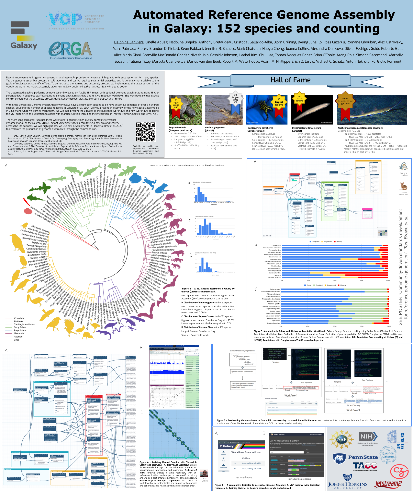
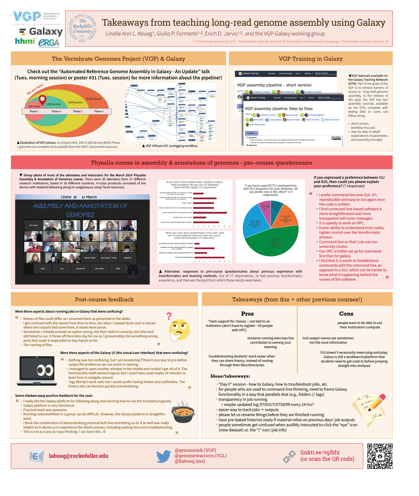

Two posters presented at this conference:
* Automated Reference Genome Assembly in Galaxy - An Update
* Takeaways from teaching long-read genome assembly using Galaxy

#### :round_pushpin: Galaxy Community Conference (Brno, Czech Republic - June 24-25, 2024)

Click through on the image for higher resolution.

# Automated Reference Genome Assembly in Galaxy - An Update

### Delphine Lariviere, **Linelle Abueg**, Nadolina Brajuka, Anthony Bretaudeau, Cristóbal Gallardo-Alba, Bjorn Grüning, Byung June Ko, Ross Lazarus, Romane Libouban, Alex Ostrovsky, Marc Palmada-Flores, Brandon D. Pickett, Keon Rabbani, Jennifer R. Balacco, Mark Chaisson, Haoyu Cheng, Joanna Collins, Alexandra Denisova, Olivier Fedrigo , Guido Roberto Gallo, Alice Maria Giani, Grenville MacDonald Gooder, Nivesh Jain, Cassidy Johnson, Heebal Kim, Chul Lee, Tomas Marques-Bonet, Brian O'Toole, Arang Rhie, Simona Secomandi, Marcella Sozzoni, Tatiana Tilley, Marcela Uliano-Silva, Marius van den Beek, Robert M. Waterhouse, Adam M. Phillippy, Erich D. Jarvis, Michael C. Schatz, Anton Nekrutenko, Giulio Formenti

Please see [Larivière, Brajuka, Abueg, *et al.* 2024](https://doi.org/10.1038/s41587-023-02100-3) for the publication referenced in this work.

# Takeaways from teaching long-read genome assembly using Galaxy

### **Linelle Abueg**, Giulio P. Formenti, Erich D. Jarvis, and the VGP-Galaxy working group

