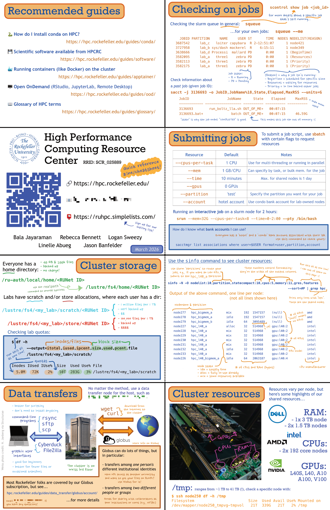

# Rockefeller University High Performance Computing Resource Center zine

Rockefeller University holds an expo where campus resource centers can display posters and have booths to meet the university consituency. For our 2026 expo, I made handout zines so people who were interested could take one with them. I wanted these to be like a 'cheatsheet' quick reference of HPC information that I would've thought useful when I was a user. 

The online version has some details omitted and is not in the original printing layout, as the printing layout has some pages upside-down due to the way the zine would be folded. 

Click through for higher resolution. 

