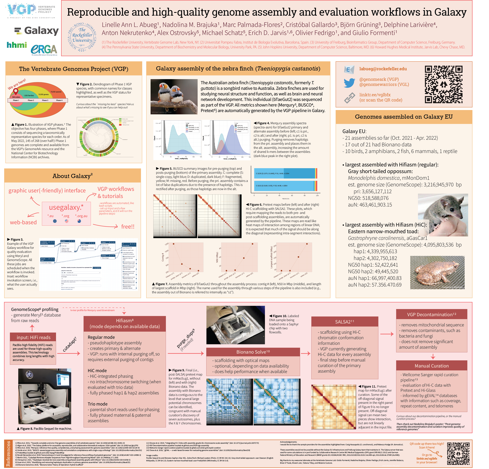

# BoG2022-poster
"Reproducible and high-quality genome assembly and evaluation workflows in Galaxy" originally presented at the Biology of Genomes conference at Cold Spring Harbor, NY on May 11 2022. Click thru for higher resolution.

